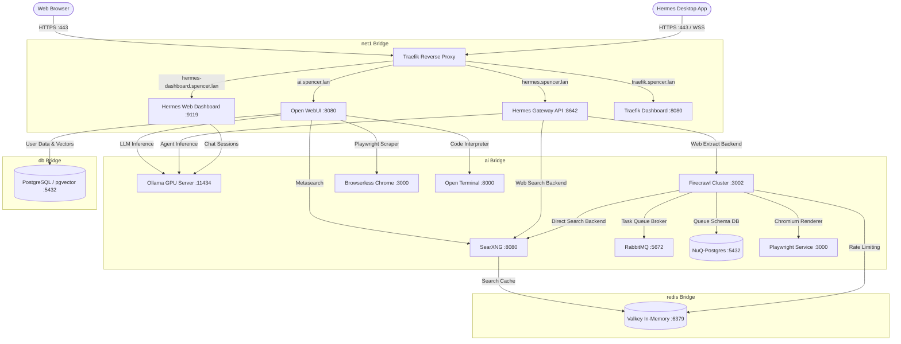

# Spencer's Homelab Reverse Proxy, LLM Runtime & AI Agent Stack

A production-grade, privacy-first local homelab environment orchestrating edge routing, local LLM inference, autonomous agents, metasearch, headless browser rendering, and web scraping with **Docker Compose**.

---

## 🧭 In-Depth Documentation Directory

Detailed architectural designs, configuration options, environment variables, and troubleshooting guides for each individual service are located in the [`docs/`](file:///data/homelab/docs/README.md) directory:

| Service | Role | Ingress & Internal Endpoints | Detailed Guide |
|---|---|---|---|
| **Traefik** | Reverse proxy, SSL termination & edge router | `:80`, `:443` (`https://traefik.spencer.lan`) | [Traefik Guide](file:///data/homelab/docs/traefik.md) |
| **Ollama** | Local LLM inference engine with GPU acceleration | `http://ollama:11434` (Internal `ai` network) | [Ollama Guide](file:///data/homelab/docs/ollama.md) |
| **Open WebUI** | ChatGPT-style web UI, multi-user, RAG & workspace | `https://ai.spencer.lan` | [Open WebUI Guide](file:///data/homelab/docs/open-webui.md) |
| **PostgreSQL / pgvector** | Relational database & high-dimensional vector store | `db:5432` (Internal `db` network) | [Postgres Guide](file:///data/homelab/docs/postgres.md) |
| **Hermes Agent** | Autonomous AI agent framework & Web dashboard | `https://hermes.spencer.lan` / `:9119` (`https://hermes-dashboard.spencer.lan`) | [Hermes Guide](file:///data/homelab/docs/hermes.md) |

| **Firecrawl Stack** | Web scraper, crawler, and search backend | `http://firecrawl:3002` (Internal `ai` network) | [Firecrawl Guide](file:///data/homelab/docs/firecrawl.md) |
| **SearXNG** | Privacy-respecting metasearch engine | `http://searxng:8080` (Internal `ai` network) | [SearXNG Guide](file:///data/homelab/docs/searxng.md) |
| **Valkey** | High-performance in-memory cache & rate limiter | `valkey:6379` (Internal `redis` network) | [Valkey Guide](file:///data/homelab/docs/valkey.md) |
| **Browserless Chrome** | Headless Chromium automation engine for scraping | `ws://browserless:3000` (Internal `ai` network) | [Browserless Guide](file:///data/homelab/docs/browserless.md) |
| **Open Terminal** | Sandboxed shell environment for code interpreter | `open-terminal:8000` (Internal `ai` network) | [Open Terminal Guide](file:///data/homelab/docs/open-terminal.md) |

---

## 🏗️ Architecture Overview




---

## 📁 Repository Structure

```text
/data/homelab/
├── docker-compose.yaml      # Master multi-container Compose manifest
├── README.md                # Main system summary and quickstart
├── CHANGELOG.md             # Date-based record of environment changes
├── TODO.md                  # Homelab roadmap and upcoming initiatives
├── AGENTS.md                # Workspace operational guidelines for AI agents

├── .env                     # Local environment secrets and configuration
├── .env.example             # Template file with documentation of all variables
├── docs/                    # Detailed service documentation
│   ├── README.md            # Documentation directory index
│   ├── traefik.md           # Traefik configuration & routing guide
│   ├── ollama.md            # Ollama setup & GPU acceleration guide
│   ├── open-webui.md        # Open WebUI features & connections
│   ├── postgres.md          # PostgreSQL & pgvector schema management
│   ├── hermes.md            # Hermes Agent runtime & toolsets
│   ├── firecrawl.md         # Firecrawl architecture, queues & scraping
│   ├── searxng.md           # SearXNG configuration & JSON engine setup
│   ├── valkey.md            # Valkey caching & healthcheck operations
│   ├── browserless.md       # Browserless headless Chrome automation
│   └── open-terminal.md     # Sandboxed workspace execution setup
├── hermes/                  # Hermes Agent persistent database, skills, memories
├── nuq-postgres/            # NuQ PostgreSQL persistent crawl state database
├── ollama/                  # Cached LLM model weights
├── open-terminal/           # Sandboxed user home directory
├── open-webui/              # Open WebUI data and cache files
├── postgres/                # PostgreSQL pgvector data directory
├── searxng/                 # SearXNG configuration and cache directories
├── traefik/                 # Traefik static, dynamic, and TLS cert configurations
└── valkey/                  # Valkey snapshot persistence directory
```

---

## 🚀 Quick Start

### 1. Prerequisites
* **Docker & Docker Compose**: Compose v2 installed.
* **NVIDIA Container Toolkit**: Required for hardware GPU acceleration on Ollama.
* **Local DNS**: `*.spencer.lan` pointed to your host IP address.
* **TLS Certificates**: Wildcard certificates in `traefik/certs/cert.pem` and `traefik/certs/key.pem`.

### 2. Environment Setup
Copy the template and adjust passwords or API keys as needed:
```bash
cp .env.example .env
```

### 3. Start the Stack
```bash
docker compose up -d
```

### 4. Verify Service Health
```bash
docker compose ps
```

---

## 🧪 Operational Commands & Health Checks

### Check Traefik Routing
Navigate to `https://traefik.spencer.lan` or check logs:
```bash
docker compose logs -f traefik
```

### Test Ollama GPU Inference
```bash
curl http://localhost:11434/api/tags
docker compose exec ollama nvidia-smi
```

### Test Internal Scraping (Firecrawl)
```bash
docker compose exec hermes curl -s -X POST http://firecrawl:3002/v1/scrape \
  -H "Content-Type: application/json" \
  -d '{"url":"https://example.com"}'
```

### Test Internal Search (SearXNG)
```bash
docker compose exec open-webui curl "http://searxng:8080/search?q=docker&format=json"
```

### Test Database Readiness
```bash
docker compose exec db pg_isready -U openwebui -d openwebui
```
