# Spencer's Homelab Reverse Proxy, LLM Runtime & AI Agent Stack

A production-grade, privacy-first local homelab environment orchestrating edge routing, local LLM inference, autonomous agents, metasearch, headless browser rendering, and web scraping with **Docker Compose**.

---

## 🧭 In-Depth Documentation Directory

Detailed architectural designs, configuration options, environment variables, and troubleshooting guides for each individual service are located in the [`docs/`](docs/README.md) directory:

| Service | Role | Ingress & Internal Endpoints | Detailed Guide |
|---|---|---|---|
| **Traefik** | Reverse proxy, SSL, Geoblock (US Only) & edge router | `:80`, `:443` (`https://traefik.spencer.lan`) | [Traefik Guide](docs/traefik.md) |
| **CrowdSec** | Intrusion detection & Traefik Bouncer plugin | `:8080` (Internal `net1` network) | [CrowdSec Guide](docs/crowdsec.md) |
| **LiteLLM Proxy** | LLM routing gateway, spend manager & fallback router | `https://llm.spencer.lan` (:4000) | [LiteLLM Guide](docs/litellm.md) |
| **Ollama** | Local LLM inference engine with GPU acceleration | `http://ollama:11434` (Internal `ai` network) | [Ollama Guide](docs/ollama.md) |
| **Open WebUI** | ChatGPT-style web UI, multi-user, RAG & workspace | `https://ai.spencer.lan` | [Open WebUI Guide](docs/open-webui.md) |
| **Hermes Agent** | Autonomous AI agent runtime, dashboard & MCP server | `https://hermes.spencer.lan` / `https://hermes-api.spencer.lan` / `https://mcp.spencer.lan` | [Hermes Guide](docs/hermes.md) |
| **Hindsight** | Long-term contextual memory engine for agents | `https://hindsight.spencer.lan` (:9999) / `:8888` | [Hindsight Guide](docs/hindsight.md) |
| **PostgreSQL (Legacy)** | Relational database & vector store for Open WebUI | `db:5432` (Internal `db` network) | [Postgres Guide](docs/postgres.md) |
| **pgvector (Standalone)** | Dedicated vector & DB instance for Hindsight & LiteLLM | `pgvector:5432` (Internal `db` network) | [pgvector Guide](docs/pgvector.md) |
| **Firecrawl Stack** | Web scraper, crawler, and search backend | `http://firecrawl:3002` (Internal `ai` network) | [Firecrawl Guide](docs/firecrawl.md) |
| **SearXNG** | Privacy-respecting metasearch engine | `http://searxng:8080` (Internal `ai` network) | [SearXNG Guide](docs/searxng.md) |
| **Valkey** | High-performance in-memory cache & rate limiter | `valkey:6379` (Internal `redis` network) | [Valkey Guide](docs/valkey.md) |
| **Browserless Chrome** | Headless Chromium automation engine for scraping | `ws://browserless:3000` (Internal `ai` network) | [Browserless Guide](docs/browserless.md) |
| **Open Terminal** | Sandboxed shell environment for code interpreter | `open-terminal:8000` (Internal `ai` network) | [Open Terminal Guide](docs/open-terminal.md) |

---

## 🏗️ Architecture Overview

```mermaid
flowchart TD
    Client([Client Browser / Remote MCP / Desktop App]) -->|HTTPS :443| Traefik[Traefik Reverse Proxy]
    Traefik <-->|1. US Allowlist & LAN Bypass| GeoPlugin[Geoblock Plugin]
    Traefik <-->|2. In-Memory Stream Mode| BouncerPlugin[CrowdSec Bouncer Plugin]
    Traefik -.->|JSON Access Logs| AccessLog["/var/log/traefik/access.log"]
    AccessLog -.->|Real-Time Acquisition| CrowdSec[CrowdSec Security Engine :8080]
    
    subgraph Exposed Ingress Network [net1 Bridge]
        Traefik -->|ai.spencer.lan| OpenWebUI[Open WebUI :8080]
        Traefik -->|hermes.spencer.lan| HermesDashboard[Hermes Web Dashboard :9119]
        Traefik -->|hermes-api.spencer.lan| HermesGateway[Hermes Gateway API :8642]
        Traefik -->|mcp.spencer.lan| HermesMCP[Hermes MCP Server :8765]
        Traefik -->|llm.spencer.lan| LiteLLM[LiteLLM Proxy & UI :4000]
        Traefik -->|hindsight.spencer.lan| HindsightUI[Hindsight Control Plane :9999]
        Traefik -->|traefik.spencer.lan| TraefikDash[Traefik Dashboard :internal]
    end

    subgraph Internal AI Network [ai Bridge]
        HermesGateway -->|Inference Routing| LiteLLM
        OpenWebUI -->|Inference Routing| LiteLLM
        LiteLLM -->|GPU Accelerated Chat/Embeddings| Ollama[Ollama GPU Server :11434]
        LiteLLM -.->|Optional Cloud Fallbacks| CloudLLM[Groq / OpenRouter / DeepSeek]
        
        HermesGateway -->|Persistent Memory| Hindsight[Hindsight Memory Engine :8888]
        Hindsight -->|Fact Extraction & Reflection| Ollama
        
        HermesGateway -->|Tool Execution| HermesMCP
        HermesGateway -->|Web Search Backend| SearXNG[SearXNG :8080]
        HermesGateway -->|Scrape & Crawl| Firecrawl[Firecrawl Cluster :3002]
        HermesGateway -->|Browser Automation| Browserless[Browserless Chrome :3000]
        HermesGateway -->|Docker Execution Socket| Sandbox[Docker Sandbox Containers]
        
        OpenWebUI -->|Metasearch| SearXNG
        OpenWebUI -->|Playwright Scraper| Browserless
        OpenWebUI -->|Code Interpreter| OpenTerminal[Open Terminal :8000]

        Firecrawl -->|Direct Search Backend| SearXNG
        Firecrawl -->|Task Queue Broker| RabbitMQ[RabbitMQ :5672]
        Firecrawl -->|Queue Schema DB| NuqPostgres[(NuQ-Postgres :5432)]
        Firecrawl -->|Chromium Renderer| Playwright[Playwright Service :3000]
    end

    subgraph Isolated Database Network [db Bridge]
        OpenWebUI -->|User Accounts & RAG Vectors| Postgres[(PostgreSQL / pgvector :5432)]
        Hindsight -->|Vector & Memory Graph DB| PgVector[(pgvector Standalone :5432)]
        LiteLLM -->|Keys, Spend & Audit DB| PgVector
    end

    subgraph Internal Cache Network [redis Bridge]
        SearXNG -->|Search Cache| Valkey[(Valkey In-Memory :6379)]
        Firecrawl -->|Rate Limiting| Valkey
    end
```



---

## 📁 Repository Structure

```text
/data/homelab/
├── docker-compose.yaml      # Master multi-container Compose manifest
├── README.md                # Main system summary and quickstart
├── CHANGELOG.md             # Date-based record of environment changes
├── TODO.md                  # Homelab roadmap and upcoming initiatives
├── AGENTS.md                # Workspace operational guidelines for AI agents
├── .env                     # Local environment secrets and configuration
├── .env.example             # Template file with documentation of all variables
├── crowdsec/                # CrowdSec intrusion detection configs & databases
│   ├── config/              # CrowdSec engine & log acquisition rules (acquis.d/)
│   └── data/                # SQLite event database and local intelligence store
├── docs/                    # Detailed service documentation
│   ├── README.md            # Documentation directory index
│   ├── browserless.md       # Browserless headless Chrome automation
│   ├── crowdsec.md          # CrowdSec security engine & Traefik bouncer guide
│   ├── firecrawl.md         # Firecrawl architecture, queues & scraping
│   ├── hermes.md            # Hermes Agent runtime, dashboard, sandbox & MCP
│   ├── hindsight.md         # Hindsight long-term agent memory engine
│   ├── litellm.md           # LiteLLM Proxy model router & spend tracker
│   ├── ollama.md            # Ollama setup & GPU acceleration guide
│   ├── open-terminal.md     # Sandboxed workspace execution setup
│   ├── open-webui.md        # Open WebUI features & connections
│   ├── pgvector.md          # Dedicated pgvector database for Hindsight & LiteLLM
│   ├── postgres.md          # PostgreSQL schema management for Open WebUI
│   ├── searxng.md           # SearXNG configuration & JSON engine setup
│   ├── traefik.md           # Traefik reverse proxy, SSL & bouncer plugin
│   └── valkey.md            # Valkey caching & healthcheck operations
├── hermes/                  # Hermes Agent persistent state, skills, MCP scripts
│   ├── config.yaml          # Hermes model providers, tools & memory configs
│   ├── hindsight/           # Profile memory configuration (config.json)
│   ├── init/                # Container s6 boot supervisor scripts (MCP server)
│   └── scripts/             # Hermes MCP server implementation (SSE & stdio)
├── litellm/                 # LiteLLM Proxy configuration (config.yaml)
├── nuq-postgres/            # NuQ PostgreSQL persistent crawl state database
├── ollama/                  # Cached LLM model weights
├── open-terminal/           # Sandboxed user home directory
├── open-webui/              # Open WebUI data and cache files
├── pgvector/                # Dedicated pgvector database data & init scripts
├── postgres/                # PostgreSQL pgvector data directory (Open WebUI)
├── searxng/                 # SearXNG configuration and cache directories
├── traefik/                 # Traefik static, dynamic, and TLS cert configurations
│   ├── certs/               # Wildcard SSL certificates (*.spencer.lan)
│   ├── dynamic.yml          # Dynamic routers, TLS & bouncer middleware
│   ├── logs/                # Traefik JSON access log (read by CrowdSec)
│   ├── traefik.yml          # Static entrypoints, plugins & log declarations
│   └── crowdsec_bouncer_key # Protected secret key file for bouncer plugin
└── valkey/                  # Valkey snapshot persistence directory
```

---

## 🚀 Quick Start

### 1. Prerequisites
* **Docker & Docker Compose**: Compose v2 installed.
* **NVIDIA Container Toolkit**: Required for hardware GPU acceleration on Ollama.
* **Local DNS**: `*.spencer.lan` pointed to your host IP address.
* **TLS Certificates**: Wildcard certificates in `traefik/certs/cert.pem` and `traefik/certs/key.pem`.

### 2. Environment Setup
Copy the template and adjust passwords or API keys as needed:
```bash
cp .env.example .env
```

### 3. Start the Stack
```bash
docker compose up -d
```

### 4. Verify Service Health
```bash
docker compose ps
```

---

## 🧪 Operational Commands & Health Checks

### Check Traefik Routing
Navigate to `https://traefik.spencer.lan` or check logs:
```bash
docker compose logs -f traefik
```

### Test Ollama GPU Inference
```bash
curl http://localhost:11434/api/tags
docker compose exec ollama nvidia-smi
```

### Test Internal Scraping (Firecrawl)
```bash
docker compose exec hermes curl -s -X POST http://firecrawl:3002/v1/scrape \
  -H "Content-Type: application/json" \
  -d '{"url":"https://example.com"}'
```

### Test Internal Search (SearXNG)
```bash
docker compose exec open-webui curl "http://searxng:8080/search?q=docker&format=json"
```

### Test Database Readiness
```bash
docker compose exec db pg_isready -U openwebui -d openwebui
```
