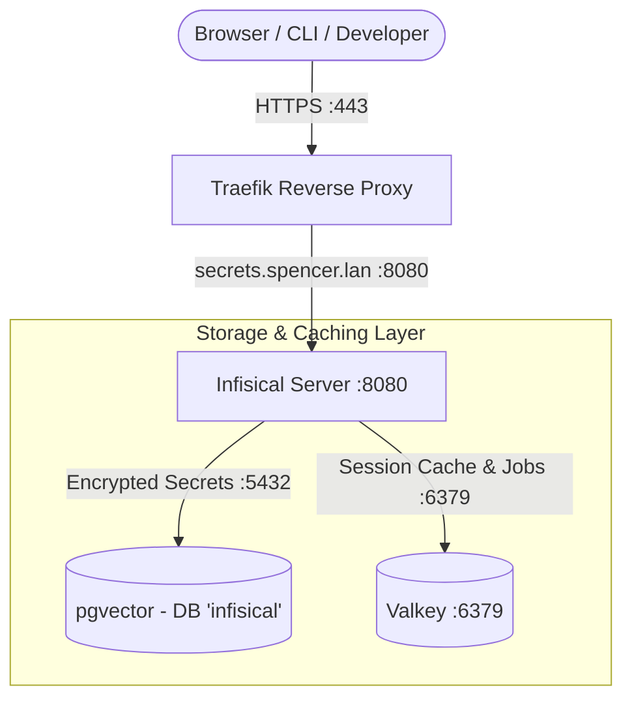

# [ARCHIVED] Infisical - Centralized Secret Management Server

> [!NOTE]
> **Status: Retired / Archived**
> Infisical has been removed from Spencer's Homelab stack. This documentation is retained for reference and disaster recovery history.

**Infisical** ([GitHub](https://github.com/Infisical/infisical)) is the open-source secret management platform for storing, versioning, managing, and syncing environment variables and application secrets across infrastructure, developer environments, and CI/CD pipelines.

---

## 🎯 Overview & Architecture

* **Role**: Centralized vault of record for secrets, environment variables, encryption keys, and secret syncing.
* **Container Name**: `infisical`
* **Image**: `infisical/infisical:${INFISICAL_VERSION:-latest}`
* **Networks**:
  * `net1`: Traefik reverse proxy bridge (`secrets.spencer.lan`, `infisical.spencer.lan`).
  * `db`: Dedicated database connection to `pgvector` for encrypted secret storage.
  * `redis`: Connection to `valkey` for session caching and job queue processing.
* **Ingress & URLs**:
  * Primary Dashboard: `https://secrets.spencer.lan`
  * Secondary Alias: `https://infisical.spencer.lan`
* **Dependencies**:
  * `pgvector` (PostgreSQL with `pgvector` extension)
  * `valkey` (In-memory Redis-compatible cache)

---

## 🔒 Security & Cryptographic Keys

1. **Root Encryption Key (`ENCRYPTION_KEY`)**:
   A cryptographically random 16-byte (32-character hex) key used by Infisical's core engine to encrypt/decrypt secrets at rest using AES-256-GCM.
2. **JWT Signing Secret (`AUTH_SECRET`)**:
   A 32-byte (256-bit base64) secret used to cryptographically sign session tokens and user authentication JWTs.
3. **Database Isolation**:
   Infisical connects to its own isolated database `infisical` on `pgvector` with a dedicated role and password.
4. **Telemetry Disabled**:
   `TELEMETRY_ENABLED=false` was enforced to prevent any outbound telemetry reporting.

---

## ⚙️ Environment Variables (Historical)

| Variable | Example / Purpose |
|---|---|
| `INFISICAL_VERSION` | `latest` |
| `INFISICAL_POSTGRES_DB` | `infisical` (Dedicated database in `pgvector`) |
| `INFISICAL_POSTGRES_USER` | `infisical` (Database role) |
| `INFISICAL_POSTGRES_PASSWORD` | Cryptographic role password |
| `INFISICAL_ENCRYPTION_KEY` | 32-hex root secret encryption key |
| `INFISICAL_AUTH_SECRET` | 256-bit base64 JWT signing secret |
| `INFISICAL_SITE_URL` | `https://secrets.spencer.lan` |
