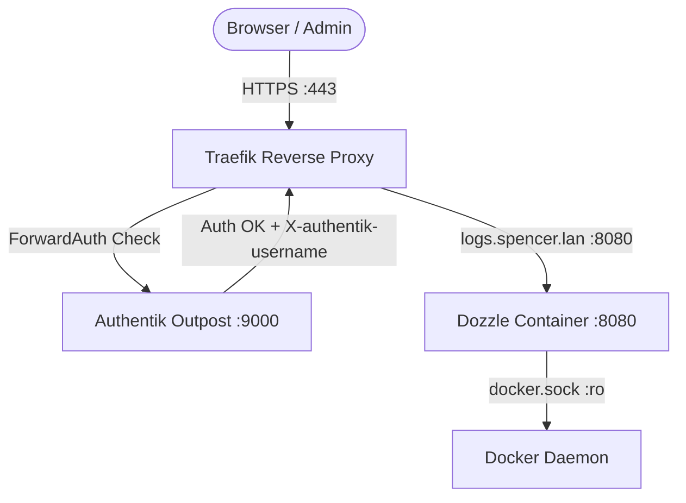

# Dozzle - Real-Time Container Log Viewer

**Dozzle** ([GitHub](https://github.com/amir20/dozzle)) is a lightweight, real-time log viewer for Docker containers with an intuitive web UI, instant streaming via WebSockets/SSE, regex search, multi-container aggregation, and statistics.

---

## 🎯 Overview & Architecture

* **Role**: Real-time browser-based container log streaming, search, and multi-service aggregation.
* **Container Name**: `dozzle`
* **Image**: `amir20/dozzle:${DOZZLE_VERSION:-latest}`
* **Network**:
  * `net1`: Connected to the Traefik reverse proxy bridge.
* **Socket Mount**:
  * `/var/run/docker.sock:/var/run/docker.sock:ro` (Strictly read-only to preserve security).
* **Ingress & URLs**:
  * Primary URL: `https://logs.spencer.lan`
  * Secondary URL: `https://dozzle.spencer.lan`
* **Authentication**:
  * Protected via Traefik ForwardAuth (`authentik@file`) redirecting to Authentik SSO.
  * Configured in `forward-proxy` mode with `DOZZLE_AUTH_HEADER_USER: X-authentik-username` so Dozzle displays the authenticated user name in the top navigation bar.



---

## 🔒 Security & SSO Integration

1. **Read-Only Docker Socket**:
   The Docker daemon socket is mounted read-only (`:ro`). Container modification actions (start, stop, restart) are disabled, preventing accidental disruption of homelab services.
2. **Authentik ForwardAuth SSO Registration**:
   Traefik intercepts all HTTP/HTTPS requests to `logs.spencer.lan` via the `authentik@file` middleware. To register Dozzle in the Authentik Admin interface:
   - **Step 1: Create Proxy Provider**:
     - Go to `https://sso.spencer.lan` ➡️ **Applications** ➡️ **Providers** ➡️ **Create**.
     - Select **Proxy Provider**.
     - **Name**: `Dozzle Logs Provider`.
     - **Mode**: `Forward auth (single application)`.
     - **External Host**: `https://logs.spencer.lan`.
     - Click **Finish**.
   - **Step 2: Create Application**:
     - Go to **Applications** ➡️ **Applications** ➡️ **Create**.
     - **Name**: `Dozzle Logs`.
     - **Slug**: `dozzle`.
     - **Provider**: Select `Dozzle Logs Provider`.
     - Click **Create**.
   - **Step 3: Bind to Embedded Outpost**:
     - Go to **Applications** ➡️ **Outposts**.
     - Edit the default **`authentik Embedded Outpost`**.
     - In the **Applications** multi-select field, select `Dozzle Logs`.
     - Click **Update**.
   
   Once bound, any browser navigating to `https://logs.spencer.lan` will authenticate against Authentik and forward user headers to Dozzle:
   - `X-authentik-username` -> `DOZZLE_AUTH_HEADER_USER`
   - `X-authentik-email` -> `DOZZLE_AUTH_HEADER_EMAIL`
   - `X-authentik-name` -> `DOZZLE_AUTH_HEADER_NAME`

3. **Internal Network Isolation**:
   Dozzle only belongs to the `net1` bridge network. It cannot directly access internal database (`db`), cache (`redis`), or agent execution (`ai`) subnets.

---

## ⚙️ Environment Variables

Configured in [`docker-compose.yaml`](file:///data/homelab/docker-compose.yaml):

| Variable | Value | Purpose |
|---|---|---|
| `DOZZLE_NO_ANALYTICS` | `true` | Disables anonymous telemetry |
| `DOZZLE_LEVEL` | `info` | Logging verbosity level |
| `DOZZLE_AUTH_PROVIDER` | `forward-proxy` | Enables reverse proxy header authentication |
| `DOZZLE_AUTH_HEADER_USER` | `X-authentik-username` | Header containing the Authentik username |
| `DOZZLE_AUTH_HEADER_EMAIL` | `X-authentik-email` | Header containing the user's display name |
| `DOZZLE_AUTH_HEADER_NAME` | `X-authentik-name` | Header containing the user's full name |

---

## 💡 Key Features & Usage Tips

* **Multi-Container View**: Click the multi-select icon in the top-left sidebar to view and interleave logs from multiple related services (e.g., `traefik`, `litellm`, and `hermes`) simultaneously.
* **Regex Filtering**: Enter regular expressions directly into the search bar at the top of any log stream to filter for specific error codes or request patterns.
* **Real-Time Memory & CPU Stats**: Container CPU and memory consumption are displayed in real-time in the sidebar next to each container.
* **Download Logs**: Click the download icon in the top right to download full unbuffered container logs for offline analysis or bug reports.
* **Clear Screen**: Press `Ctrl+K` (or click the clear button) to reset the current log buffer without affecting the actual container stdout/stderr.

---

## 🩺 Operational Checks

* **Healthcheck**:
  ```bash
  docker compose exec dozzle /dozzle healthcheck
  ```
* **Container Status**:
  ```bash
  docker compose ps dozzle
  ```
* **Verify Traefik Routing**:
  ```bash
  curl -k -s -I "https://logs.spencer.lan"
  # Expected: HTTP 302 redirecting to Authentik SSO
  ```
