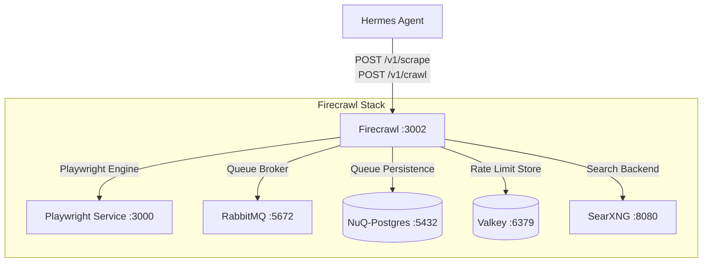

# Firecrawl Scraping & Crawling Engine

Firecrawl is an open-source web scraping, crawling, and search engine converting websites and web pages into clean, LLM-ready markdown data.

---

## 🎯 Overview & Architecture

* **Role**: Primary extraction, scraping, and crawling backend for Hermes Agent and homelab tools.
* **Architecture**: Multi-process unified container backed by RabbitMQ, NuQ-Postgres, Playwright, and Valkey.
* **Internal Port**: `3002` (Strictly internal on `ai` and `redis` networks)



---

## 🧩 Component Breakdown

| Container / Service | Image | Role |
|---|---|---|
| `firecrawl` | `ghcr.io/firecrawl/firecrawl:latest` | Unified container running API, main worker, extract worker, and reconcilers |
| `rabbitmq` | `rabbitmq:3-management` | Real-time AMQP message broker for task dispatching |
| `nuq-postgres` | `ghcr.io/firecrawl/nuq-postgres:latest` | Dedicated PostgreSQL instance housing NuQ queue schema and job history |
| `playwright-service` | `ghcr.io/firecrawl/playwright-service:latest` | Headless Chromium browser rendering engine |
| `valkey` | `docker.io/valkey/valkey:9-alpine` | Redis-compatible session and rate-limit cache |

---

## ⚙️ Environment Variables

| Variable | Reference / Value | Purpose |
|---|---|---|
| `PORT` | `3002` | Internal HTTP API port |
| `REDIS_URL` | `redis://valkey:6379` | Valkey caching endpoint |
| `PLAYWRIGHT_MICROSERVICE_URL` | `http://playwright-service:3000/scrape` | Headless browser scraper endpoint |
| `NUQ_RABBITMQ_URL` | `amqp://rabbitmq:5672` | RabbitMQ broker connection |
| `POSTGRES_HOST` | `nuq-postgres` | NuQ database host |
| `FIRECRAWL_POSTGRES_USER` | `${FIRECRAWL_POSTGRES_USER}` | NuQ database username |
| `FIRECRAWL_POSTGRES_PASSWORD` | `${FIRECRAWL_POSTGRES_PASSWORD}` | NuQ database password |
| `SEARXNG_ENDPOINT` | `http://searxng:8080` | Direct search backend |
| `USE_DB_AUTHENTICATION` | `false` | Internal authentication toggle |
| `NUM_WORKERS_PER_QUEUE` | `4` | Worker concurrency per queue |
| `CRAWL_CONCURRENT_REQUESTS` | `10` | Maximum simultaneous browser crawls |

---

## 📁 Mounted Volumes

| Service | Host Path | Container Path | Purpose |
|---|---|---|---|
| `nuq-postgres` | `./nuq-postgres` | `/var/lib/postgresql/data` | Persists crawl queue tables and job state |

---

## 🛠️ API Testing Commands

### 1. Direct Scrape
```bash
docker compose exec hermes curl -s -X POST http://firecrawl:3002/v1/scrape \
  -H "Content-Type: application/json" \
  -d '{"url":"https://example.com"}'
```

### 2. Standalone Search via SearXNG Backend
```bash
docker compose exec hermes curl -s -X POST http://firecrawl:3002/v1/search \
  -H "Content-Type: application/json" \
  -d '{"query":"homelab"}'
```
