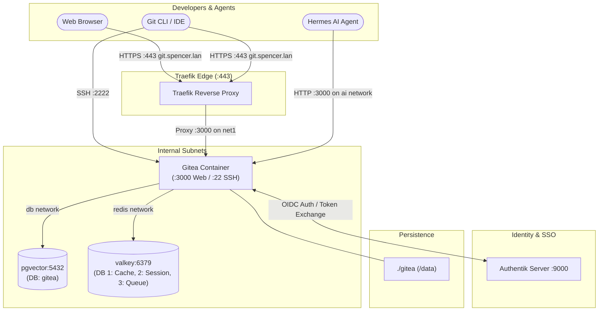

# Gitea - Self-Hosted Lightweight Git Platform

**Gitea** ([GitHub](https://github.com/go-gitea/gitea) / [gitea.com](https://gitea.com)) is a painless, self-hosted, lightweight software development and Git collaboration platform featuring repositories, code review, issues, pull requests, wikis, and organization management.

---

## 🎯 Overview & Architecture

* **Role**: Centralized source code version control, private Git hosting, issue tracking, and agent repository manager for Spencer's homelab.
* **Container Name**: `gitea`
* **Image**: `gitea/gitea:${GITEA_VERSION:-latest}`
* **User**: `"${PUID:-1000}:${PGID:-1000}"`
* **Networks**:
  * `net1`: Edge reverse proxy network connecting Traefik to Gitea for web UI and HTTP Git operations.
  * `db`: Dedicated database network communicating directly with `pgvector` on port `5432`.
  * `redis`: Dedicated caching network communicating with Valkey on port `6379` for caches, sessions, and task queues.
  * `ai`: Private inter-service network allowing Hermes Agent and AI microservices to interact directly with Git APIs (`http://gitea:3000`).
* **Ingress & URLs**:
  * Internal LAN URL: `https://git.spencer.lan` (TLS via local wildcard certificate)
  * Internal LAN Alias: `https://gitea.spencer.lan`
  * Public WAN URL: `https://${GITEA_PUBLIC_DOMAIN:-git.example.com}` (TLS via Let's Encrypt ACME)
  * SSH Clone Endpoint: `ssh://git@git.spencer.lan:2222/<owner>/<repo>.git`
  * Internal Direct Endpoint: `http://gitea:3000`
* **Authentication**:
  * **Interactive Web SSO**: Authentik OpenID Connect (OIDC) integration enabling single-click login with local homelab accounts.
  * **Git CLI / API**: Native Git Personal Access Tokens (PAT) and SSH Public Key authentication.



---

## 🔒 Authentik OIDC Single Sign-On Integration

Gitea integrates with Authentik via OpenID Connect (OIDC) to allow seamless web authentication while keeping Git CLI and SSH credentials decoupled.

### Step 1: Create OAuth2/OIDC Provider in Authentik Admin
1. Open `https://sso.spencer.lan` and log in as an administrator.
2. Navigate to **Applications** ➡️ **Providers** ➡️ **Create**.
3. Select **OAuth2/OpenID Provider**.
4. Configure provider fields:
   * **Name**: `Gitea Provider`
   * **Authentication Flow**: Default identification flow
   * **Authorization Flow**: Default consent flow (or implicit consent)
   * **Client Type**: `Confidential`
   * **Client ID**: `gitea` (matches `GITEA_OIDC_CLIENT_ID`)
   * **Client Secret**: Paste the secret configured in `.env` (`GITEA_OIDC_CLIENT_SECRET`)
   * **Redirect URIs**: 
     ```
     https://git.spencer.lan/user/oauth2/authentik/callback
     https://gitea.spencer.lan/user/oauth2/authentik/callback
     https://${GITEA_PUBLIC_DOMAIN}/user/oauth2/authentik/callback
     ```
   * **Signing Key**: `authentik Self-signed Certificate`
   * **Scopes**: `openid`, `email`, `profile`
5. Click **Finish**.

### Step 2: Create Application in Authentik Admin
1. Navigate to **Applications** ➡️ **Applications** ➡️ **Create**.
2. Configure application fields:
   * **Name**: `Gitea`
   * **Slug**: `gitea`
   * **Provider**: Select `Gitea Provider`.
   * **Launch URL**: `https://git.spencer.lan`
3. Click **Create**.

### Step 3: Register Authentik in Gitea
1. Log in to Gitea with an administrator account at `https://git.spencer.lan`.
2. Go to **Site Administration** ➡️ **Authentication Sources** ➡️ **Add Authentication Source**.
3. Select **OAuth2**.
4. Fill in:
   * **Authentication Name**: `Authentik`
   * **OAuth2 Provider**: `OpenID Connect`
   * **Client ID (Key)**: `gitea`
   * **Client Secret**: `<GITEA_OIDC_CLIENT_SECRET>`
   * **OpenID Connect Auto Discovery URL**:
     `https://<SSO_PUBLIC_DOMAIN>/application/o/gitea/.well-known/openid-configuration`
5. Enable **Update existing users** and **Auto-Registration Enabled** (if desired).
6. Click **Save**.

---

## 💻 SSH Git Operations

The host SSH server runs on default port `22`. Gitea exposes SSH on host port **`2222`**.

### Git SSH URL Format
```bash
git clone ssh://git@git.spencer.lan:2222/<username>/<repository>.git
```

### SSH Client Config Shortcut
To avoid typing `-p 2222` or `ssh://`, add the following block to your local `~/.ssh/config`:

```sshconfig
Host git.spencer.lan
    HostName git.spencer.lan
    Port 2222
    User git
    IdentityFile ~/.ssh/id_ed25519
```

Once configured, standard syntax works seamlessly:
```bash
git clone git@git.spencer.lan:<username>/<repository>.git
```

---

## ⚙️ Environment Variables

Configured in [`docker-compose.yaml`](file:///data/homelab/docker-compose.yaml) and [`.env`](file:///data/homelab/.env):

| Variable | Default / Homelab Value | Purpose |
|---|---|---|
| `GITEA_VERSION` | `latest` | Docker image tag for Gitea |
| `GITEA_POSTGRES_DB` | `gitea` | Database name on `pgvector` |
| `GITEA_POSTGRES_USER` | `gitea` | PostgreSQL role for Gitea |
| `GITEA_POSTGRES_PASSWORD` | `<secure-generated>` | Database password |
| `GITEA_PUBLIC_DOMAIN` | `git.jamesspencer.me` | Public WAN domain for Traefik Let's Encrypt |
| `GITEA_OIDC_CLIENT_ID` | `gitea` | Authentik OIDC client identifier |
| `GITEA_OIDC_CLIENT_SECRET`| `<secure-generated>` | Authentik OIDC client secret |
| `GITEA__server__DOMAIN` | `git.spencer.lan` | Primary domain name displayed in clone URLs |
| `GITEA__server__SSH_PORT`| `2222` | External SSH port exposed on host |

---

## 🩺 Operational Checks & Maintenance

* **Healthcheck & Status**:
  ```bash
  docker compose ps gitea
  curl -k -s https://git.spencer.lan/api/healthz
  ```
  Expected output includes `"status": "pass"` for both `database:ping` and `cache:ping`.

* **SSH Service Verification**:
  ```bash
  ssh -p 2222 -o StrictHostKeyChecking=no git@git.spencer.lan
  # Expected: "PTY allocation request failed on channel 0" or "Hi there, You've successfully authenticated"
  ```

* **Gitea CLI Commands**:
  Execute CLI operations directly inside the container as user `1000`:
  ```bash
  # Create an administrator user
  docker exec -it -u 1000 gitea gitea admin user create --username spencer --password <password> --email spencer@spencer.lan --admin

  # Generate Gitea backup archive
  docker exec -it -u 1000 gitea gitea dump -c /data/gitea/conf/app.ini --file /data/gitea-dump.zip
  ```

* **Container Logs**:
  ```bash
  docker logs -f gitea
  ```
