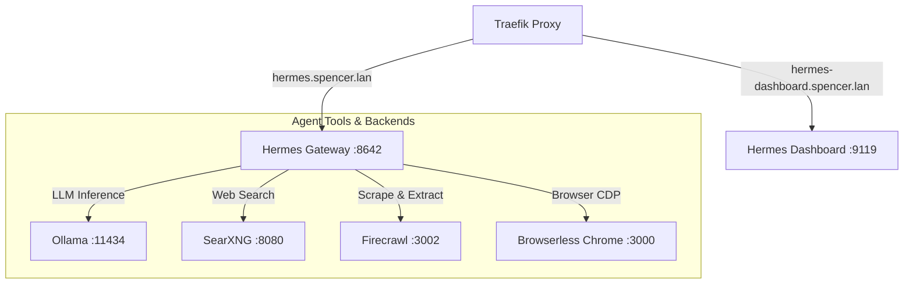

# Nous Research Hermes Agent

Hermes Agent is an autonomous agent framework and gateway providing tool execution, scheduling, delegation, and web automation capabilities.

---

## 🎯 Overview & Architecture

* **Role**: Autonomous AI agent runtime, API gateway, and management dashboard.
* **Container Name**: `hermes`
* **Image**: `nousresearch/hermes-agent:latest`
* **Command**: `gateway run` (supervised under `s6`)
* **Networks**:
  * `net1`: Ingress routing from Traefik.
  * `ai`: Connection to Ollama, SearXNG, Firecrawl, and Browserless.
* **External Ingress**:
  * Gateway API: `https://hermes.spencer.lan` (`:8642` internally)
  * Dashboard Web UI: `https://hermes-dashboard.spencer.lan` (`:9119` internally)



---

## ⚙️ Configuration & Toolsets

### 1. `hermes/config.yaml`
Configured to use **SearXNG** for queries and **Firecrawl** for content extraction:
```yaml
model:
  default: ${HERMES_MODEL}
  provider: ${HERMES_PROVIDER}
  base_url: ${CUSTOM_BASE_URL}
web:
  search_backend: searxng
  extract_backend: firecrawl
```

### 2. Environment Variables (`.env`)

| Variable | Reference / Value | Purpose |
|---|---|---|
| `HERMES_API_KEY` | `${HERMES_API_KEY}` | API Server authentication key |
| `HERMES_PROVIDER` | `custom` | LLM backend provider type |
| `CUSTOM_BASE_URL` | `http://ollama:11434/v1` | Ollama OpenAI-compatible endpoint |
| `HERMES_MODEL` | `qwen2.5:14b` | Default primary agent LLM model |
| `HERMES_DASHBOARD` | `1` | Enables Web UI dashboard |
| `HERMES_DASHBOARD_BASIC_AUTH_USERNAME` | `spencer` | Dashboard login username |
| `HERMES_DASHBOARD_BASIC_AUTH_PASSWORD_HASH` | `${...}` | Scrypt password hash for authentication |
| `SEARXNG_URL` | `http://searxng:8080` | SearXNG query endpoint |
| `FIRECRAWL_API_URL` | `http://firecrawl:3002` | Firecrawl extraction endpoint |
| `BROWSER_CDP_URL` | `ws://browserless:3000` | Browserless Chrome CDP endpoint |

---

## 📁 Mounted Volumes

| Host Path | Container Path | Purpose |
|---|---|---|
| `./hermes` | `/opt/data` | Persists agent state, databases (`state.db`, `kanban.db`, `projects.db`), skills, memories, and configuration |
