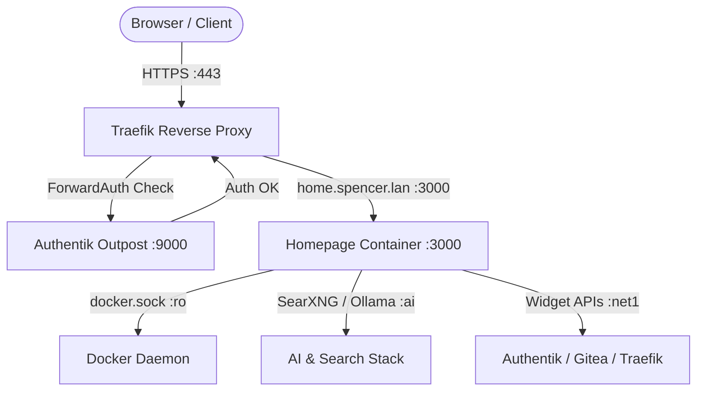

# Homepage - Homelab Dashboard & Service Portal

**Homepage** ([GitHub](https://github.com/gethomepage/homepage) / [Docs](https://gethomepage.dev)) is a modern, highly customizable, fast, and secure homelab dashboard. It serves as the primary starting point and service directory for Spencer's Homelab, integrating live container health, resource metrics, SearXNG search, and service widgets.

---

## 🎯 Overview & Architecture

* **Role**: Centralized homelab dashboard, service status monitor, and quick launcher.
* **Container Name**: `homepage`
* **Image**: `ghcr.io/gethomepage/homepage:${HOMEPAGE_VERSION:-latest}`
* **Networks**:
  * `net1`: Ingress network connected to Traefik reverse proxy and internal web services (Authentik, Gitea, Dozzle).
  * `ai`: High-speed network for direct widget querying to Ollama (`:11434`) and SearXNG (`:8080`).
* **Socket Mount**:
  * `/var/run/docker.sock:/var/run/docker.sock:ro` (Strictly read-only to monitor container states, CPU, and memory).
* **Ingress & URLs**:
  * Primary LAN URL: `https://home.spencer.lan`
  * Secondary LAN URL: `https://homepage.spencer.lan`
  * Public WAN URL: `https://${HOMEPAGE_PUBLIC_DOMAIN}` (Optional, via Let's Encrypt)
* **Authentication**:
  * Protected via Traefik ForwardAuth (`authentik@file`) redirecting to Authentik SSO (`sso.spencer.lan`).



---

## 📁 Configuration Directory Structure

All declarative configurations are mounted from `./homepage/config` to `/app/config`:

```
homepage/config/
├── settings.yaml      # Dashboard layout, themes, columns, header styling
├── docker.yaml        # Docker socket connection for live container stats
├── widgets.yaml       # Header search bar (SearXNG) and system resources (CPU/RAM/Disk)
├── services.yaml      # Categorized service tiles with icons, links, and container bindings
└── bookmarks.yaml     # Useful quick links to docs, repos, and administrative resources
```

### 1. `settings.yaml`
Configures overall look and feel, dark theme (`slate`), and grid layout columns for each category:
* **AI & Agents** (3 columns)
* **Search & Scrape** (2 columns)
* **Core Infrastructure** (3 columns)
* **Developer Tools & Ops** (3 columns)
* **Data & Storage** (3 columns)

### 2. `docker.yaml`
Enables Docker container telemetry:
```yaml
local-docker:
  socket: /var/run/docker.sock
```

### 3. `widgets.yaml`
Defines dashboard header widgets:
* **Custom Search**: Points directly to `https://search.spencer.lan/search?q=`
* **System Resources**: Displays live CPU and Memory utilization.

### 4. `services.yaml`
Organizes all services across Spencer's Homelab with custom dashboard icons and links:
* **AI & Agents**: Hermes Agent, LiteLLM Gateway, Hindsight Long-Term Memory, Ollama LLM, Hermes Gateway & MCP.
* **Search & Scrape**: SearXNG, Firecrawl.
* **Core Infrastructure**: Traefik Proxy, Authentik IAM, CrowdSec.
* **Developer Tools & Ops**: Gitea, Dozzle, ntfy.
* **Data & Storage**: pgvector PostgreSQL 16, Valkey Cache, RabbitMQ.

---

## 🔒 Security & Authentik SSO Integration

1. **Read-Only Docker Socket & Group Alignment**:
   The Docker socket is mounted strictly read-only (`:ro`). To allow the non-root Node process within the Homepage container to communicate with `/var/run/docker.sock`, `PGID` is configured to match the host's `docker` group ID (`${DOCKER_GID:-983}`) alongside `group_add`. This eliminates `EACCES` errors while preserving read-only constraints.
2. **Authentik ForwardAuth Setup**:
   To register Homepage in the Authentik Admin interface (`https://sso.spencer.lan`):
   - **Step 1: Create Proxy Provider**:
     - Navigate to **Applications** ➡️ **Providers** ➡️ **Create**.
     - Select **Proxy Provider**.
     - **Name**: `Homepage Dashboard Provider`.
     - **Mode**: `Forward auth (single application)`.
     - **External Host**: `https://home.spencer.lan`.
     - Click **Finish**.
   - **Step 2: Create Application**:
     - Navigate to **Applications** ➡️ **Applications** ➡️ **Create**.
     - **Name**: `Homepage`.
     - **Slug**: `homepage`.
     - **Provider**: Select `Homepage Dashboard Provider`.
     - Click **Create**.
   - **Step 3: Bind to Embedded Outpost**:
     - Navigate to **Applications** ➡️ **Outposts**.
     - Edit `authentik Embedded Outpost`.
     - In the **Applications** field, add `Homepage`.
     - Click **Update**.

---

## 🛠️ Operations & Maintenance

### Inspect Logs
```bash
docker compose logs -f homepage
```

### Apply Configuration Edits
Homepage automatically watches files in `/app/config` and hot-reloads most changes. To force a restart:
```bash
docker compose restart homepage
```

### Recreate Container After Updates
```bash
docker compose up -d --force-recreate homepage
```
