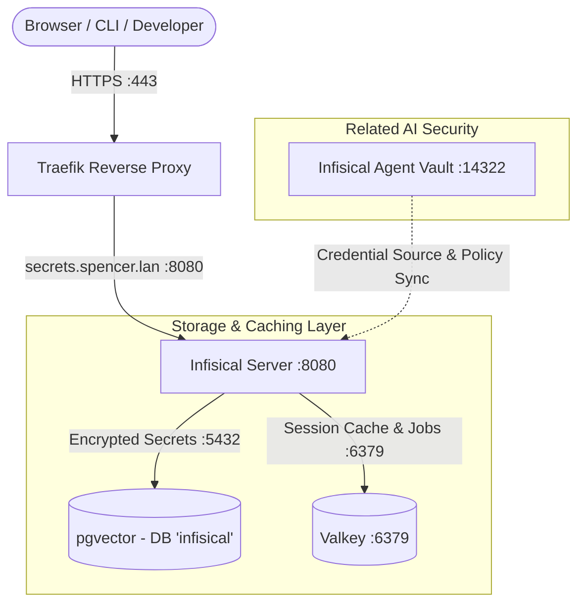

# Infisical - Centralized Secret Management Server

**Infisical** ([GitHub](https://github.com/Infisical/infisical)) is the open-source secret management platform for storing, versioning, managing, and syncing environment variables and application secrets across infrastructure, developer environments, and CI/CD pipelines.

---

## 🎯 Overview & Architecture

* **Role**: Centralized vault of record for secrets, environment variables, encryption keys, and secret syncing.
* **Container Name**: `infisical`
* **Image**: `infisical/infisical:${INFISICAL_VERSION:-latest}`
* **Networks**:
  * `net1`: Traefik reverse proxy bridge (`secrets.spencer.lan`, `infisical.spencer.lan`).
  * `db`: Dedicated database connection to `pgvector` for encrypted secret storage.
  * `redis`: Connection to `valkey` for session caching and job queue processing.
* **Ingress & URLs**:
  * Primary Dashboard: `https://secrets.spencer.lan`
  * Secondary Alias: `https://infisical.spencer.lan`
* **Dependencies**:
  * `pgvector` (PostgreSQL 17 with `pgvector` extension)
  * `valkey` (In-memory Redis-compatible cache)



---

## 🔒 Security & Cryptographic Keys

1. **Root Encryption Key (`ENCRYPTION_KEY`)**:
   A cryptographically random 16-byte (32-character hex) key used by Infisical's core engine to encrypt/decrypt secrets at rest using AES-256-GCM.
   > [!CAUTION]
   > Store your `ENCRYPTION_KEY` in a secure offline location. If this key is lost, all secrets in the database are unrecoverable.
2. **JWT Signing Secret (`AUTH_SECRET`)**:
   A 32-byte (256-bit base64) secret used to cryptographically sign session tokens and user authentication JWTs.
3. **Database Isolation**:
   Infisical connects to its own isolated database `infisical` on `pgvector` with a dedicated role and password.
4. **Telemetry Disabled**:
   `TELEMETRY_ENABLED=false` is enforced to prevent any outbound telemetry reporting.

---

## ⚙️ Environment Variables

Configured in [`.env`](file:///data/homelab/.env) and [`docker-compose.yaml`](file:///data/homelab/docker-compose.yaml):

| Variable | Example / Purpose |
|---|---|
| `INFISICAL_VERSION` | `latest` |
| `INFISICAL_POSTGRES_DB` | `infisical` (Dedicated database in `pgvector`) |
| `INFISICAL_POSTGRES_USER` | `infisical` (Database role) |
| `INFISICAL_POSTGRES_PASSWORD` | Cryptographic role password |
| `INFISICAL_ENCRYPTION_KEY` | 32-hex root secret encryption key |
| `INFISICAL_AUTH_SECRET` | 256-bit base64 JWT signing secret |
| `INFISICAL_SITE_URL` | `https://secrets.spencer.lan` |

---

## 🚀 Getting Started & First-Time Setup

1. **Access Initial Setup**:
   Open **`https://secrets.spencer.lan`** in your browser.
2. **Create Admin User**:
   Complete the onboarding wizard to register the initial administrator account (name, email, master password, and recovery codes).
3. **Create Organizations & Projects**:
   - Organize projects (e.g. `Homelab Core`, `Hermes Stack`, `Automation`).
   - Define environments (`development`, `staging`, `production`).
4. **Add Secrets**:
   Store API keys, database credentials, webhook tokens, and environment configs directly in the dashboard.

---

## 💻 CLI Integration & Developer Workflow

Install the Infisical CLI on developer workstations:

```bash
# macOS
brew install infisical/get-cli/infisical

# Linux / Debian / Ubuntu
curl -1sLf 'https://dl.cloudsmith.io/public/infisical/infisical-cli/setup.deb.sh' | sudo -E bash
sudo apt-get update && sudo apt-get install -y infisical
```

### 1. Login to Self-Hosted Instance
```bash
infisical login --domain https://secrets.spencer.lan
```

### 2. Inject Secrets into Local Commands
```bash
# Run a command with secrets injected into environment
infisical run --env=production -- python app.py

# Export secrets as .env file
infisical export --env=production > .env
```

---

## 🤝 Relationship to Infisical Agent Vault

* **Infisical Secret Manager** (`secrets.spencer.lan`):
  The centralized **vault of record** for all human developers, infrastructure deployment pipelines, and persistent secret lifecycles.
* **Infisical Agent Vault** (`vault.spencer.lan` / MITM proxy `:14322`):
  The **wire credential broker** specifically protecting autonomous AI agents (Hermes, Claude Code, Cursor) from prompt injection and exfiltration attacks by ensuring the agent never holds raw credentials in memory.

---

## 🩺 Operational Checks

* **Healthcheck**:
  ```bash
  docker compose exec infisical curl -f http://localhost:8080/api/status
  ```
* **Status**:
  ```bash
  docker compose ps infisical
  ```
* **Verify Traefik Routing**:
  ```bash
  curl -k -s -I --resolve secrets.spencer.lan:443:127.0.0.1 "https://secrets.spencer.lan/api/status"
  ```
