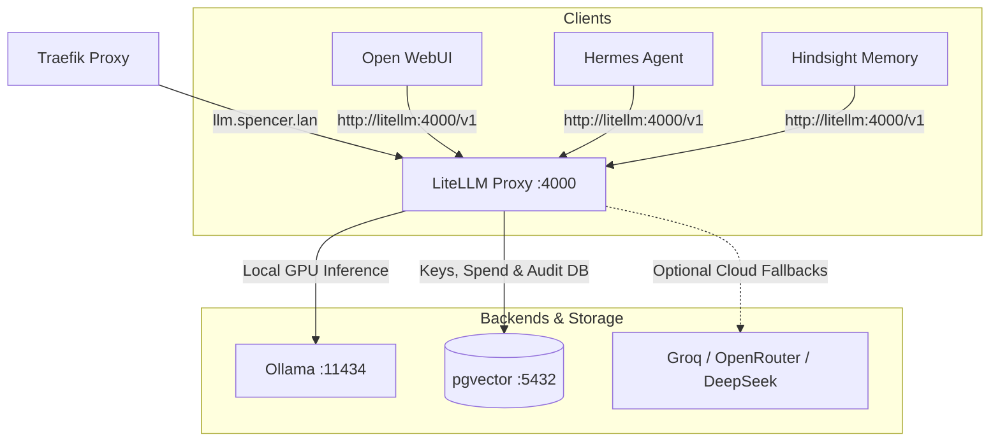

# LiteLLM Proxy - Centralized Homelab LLM Router

LiteLLM Proxy provides a unified, OpenAI-compatible proxy gateway and router for all local and external large language models in Spencer's Homelab.

---

## 🎯 Overview & Architecture

* **Role**: Centralized LLM dispatch gateway, model router, and token/spend tracker.
* **Container Name**: `litellm`
* **Image**: `ghcr.io/berriai/litellm:main-latest`
* **Networks**:
  * `net1`: Traefik reverse proxy ingress (`llm.spencer.lan`).
  * `ai`: Internal communication with Ollama (`ollama:11434`), Hermes Agent, Open WebUI, and Hindsight.
  * `db`: PostgreSQL connection to `pgvector` for key management, spend tracking, and audit logging.
* **External Ingress & Ports**:
  * API Endpoint: `https://llm.spencer.lan/v1`
  * Admin & Playground UI: `https://llm.spencer.lan/ui`
  * Internal Service Port: `http://litellm:4000/v1`



---

## ⚙️ Model Catalog & Routing

Defined in [`litellm/config.yaml`](file:///data/homelab/litellm/config.yaml):

| Model Name / Alias | Target Backend | Model Type | Capabilities |
|---|---|---|---|
| `qwen2.5:14b` | `ollama/qwen2.5:14b` via `http://ollama:11434` | Chat / Reasoning | GPU-accelerated local instruction & tool calling |
| `default` | `ollama/qwen2.5:14b` via `http://ollama:11434` | Chat Alias | Default homelab fallback model |
| `nomic-embed-text` | `ollama/nomic-embed-text` via `http://ollama:11434` | Embeddings | High-performance text vector embeddings |
| `groq/llama-3.3-70b-versatile` | Groq Cloud (`GROQ_API_KEY`) | Ultra-Fast Cloud | Fast cloud fallback when local GPU is saturated |
| `openrouter/auto` | OpenRouter (`OPENROUTER_API_KEY`) | Auto-Routed Cloud | Flexible fallback routing to leading foundation models |
| `deepseek/deepseek-chat` | DeepSeek (`DEEPSEEK_API_KEY`) | Cost-Efficient Cloud | Large-context coding and reasoning |

---

## 🔒 Security, Authentication & Admin UI

1. **Master Key**:
   The admin key configured in `.env` (`LITELLM_MASTER_KEY`) grants full access to the API and Admin UI at `https://llm.spencer.lan/ui`.
2. **Authentik OpenID Connect (OIDC) Single Sign-On**:
   LiteLLM is natively integrated with Authentik IAM via standard Generic OIDC:
   - **Provider Name**: `LiteLLM Proxy OIDC` (`client_id: litellm`)
   - **Authorization Endpoint**: `https://<sso-public-domain>/application/o/authorize/`
   - **Token Endpoint**: `https://<sso-public-domain>/application/o/token/`
   - **Userinfo Endpoint**: `https://<sso-public-domain>/application/o/userinfo/`
   - **Redirect URI**: `https://llm.spencer.lan/sso/callback`
   - **Login Initiation**: `https://llm.spencer.lan/sso/key/generate`
   - **Scopes**: `openid profile email`
   - **User ID Claim**: `preferred_username` (or `sub`)
   Users logging into `https://llm.spencer.lan/ui` authenticate through Authentik without exposing credentials directly to the proxy.
3. **Client API Keys**:
   You can create scoped, rate-limited, and budget-capped API keys for specific clients or users directly from the Web UI or via the `/key/generate` endpoint.
4. **Database Schema**:
   All user profiles, keys, spend logs, and audit trails persist in the dedicated `litellm` database on `pgvector`.

---

## 🔌 Client Integration

### 1. Pointing Hermes Agent to LiteLLM
Hermes connects directly to LiteLLM over the internal `ai` Docker network.
- **In `.env`**:
  ```bash
  CUSTOM_BASE_URL=http://litellm:4000/v1
  HERMES_MODEL=qwen2.5:14b
  ```
- **In `docker-compose.yaml`**:
  ```yaml
  environment:
    - CUSTOM_BASE_URL=${CUSTOM_BASE_URL:-http://litellm:4000/v1}
    - CUSTOM_API_KEY=${LITELLM_MASTER_KEY}
    - OPENAI_API_KEY=${LITELLM_MASTER_KEY}
  depends_on:
    - litellm
  ```
- **In `hermes/config.yaml`**:
  ```yaml
  model:
    default: qwen2.5:14b
    provider: custom
    base_url: http://litellm:4000/v1
    context_length: 65536
    ollama_num_ctx: 65536
  custom_providers:
    - name: litellm
      base_url: http://litellm:4000/v1
      key_env: CUSTOM_API_KEY
      context_length: 65536
      models:
        - qwen2.5:14b
        - default
  ```

### 2. Pointing Open WebUI to LiteLLM
In Open WebUI settings (`Admin Panel` -> `Connections` -> `OpenAI API`):
- **API Base URL**: `http://litellm:4000/v1`
- **API Key**: `${LITELLM_MASTER_KEY}`

### 3. Pointing Hindsight to LiteLLM
In `docker-compose.yaml`:
```yaml
HINDSIGHT_API_LLM_BASE_URL=http://litellm:4000/v1
HINDSIGHT_API_LLM_MODEL=qwen2.5:14b
```

---

## 📁 Mounted Volumes & Configuration Files

| Host Path | Container Path | Purpose |
|---|---|---|
| `./litellm/config.yaml` | `/etc/litellm/config.yaml:ro` | Declarative model catalog, router rules, and settings |
