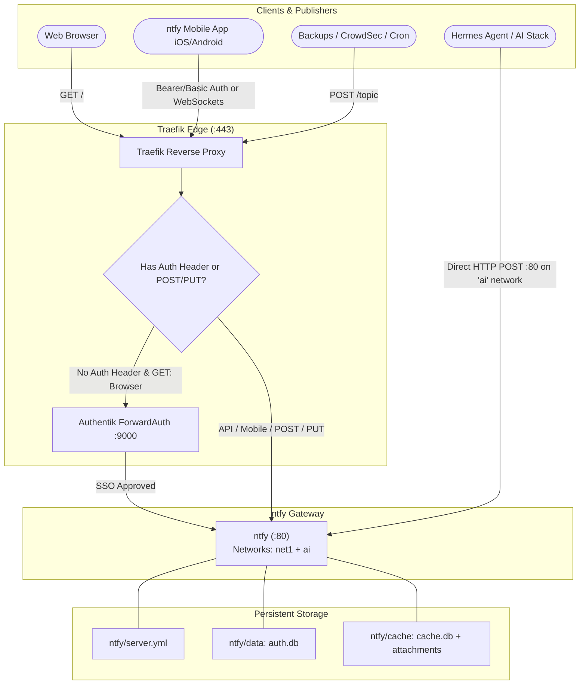

# ntfy - Self-Hosted Push Notification Gateway

**ntfy** ([GitHub](https://github.com/binwiederhier/ntfy) / [ntfy.sh](https://ntfy.sh)) is an HTTP-based pub-sub notification gateway designed to deliver instant push notifications to mobile devices (iOS and Android) and desktop browsers with zero bloat.

---

## 🎯 Overview & Architecture

* **Role**: Centralized push notification gateway for homelab backup events, CrowdSec security bans, Hermes AI task completions, and system monitoring alerts.
* **Container Name**: `ntfy`
* **Image**: `binwiederhier/ntfy:${NTFY_VERSION:-latest}`
* **User**: `"${PUID:-1000}:${PGID:-1000}"`
* **Networks**:
  * `net1`: Edge reverse proxy network connecting Traefik to the ntfy container.
  * `ai`: Private inter-service network allowing Hermes Agent and AI microservices to publish notifications directly over `http://ntfy:80` without TLS or external routing overhead.
* **Ingress & URLs**:
  * Public WAN URL: `https://${NTFY_PUBLIC_DOMAIN:-push.example.com}` (TLS via Let's Encrypt ACME resolver)
  * Internal LAN URL: `https://push.spencer.lan` (TLS via local wildcard certificate)
  * Internal LAN Alias: `https://ntfy.spencer.lan`
  * Internal Direct AI Endpoint: `http://ntfy:80`
* **Authentication & Dual Ingress Routing**:
  * **Interactive Web UI**: Protected by Traefik ForwardAuth (`authentik@file`) redirecting browser sessions to Authentik SSO.
  * **API & Mobile App Endpoints**: Traefik automatically bypasses ForwardAuth for requests containing `Authorization` headers (`Bearer` or `Basic`) or `POST`/`PUT` methods, allowing native mobile apps and API webhooks to communicate uninterrupted.
* **iOS Background Push Relay**: Configured with `upstream-base-url: "https://ntfy.sh"` so the official iOS app receives background push alerts via Apple APNs without requiring custom self-hosted Apple Developer certificates.



---

## 🔒 Security & Authentik SSO Integration

To enable single sign-on for the web interface, register ntfy in Authentik:

1. **Step 1: Create Proxy Provider**:
   * Navigate to `https://sso.spencer.lan` ➡️ **Applications** ➡️ **Providers** ➡️ **Create**.
   * Select **Proxy Provider**.
   * **Name**: `ntfy Push Provider`.
   * **Mode**: `Forward auth (single application)`.
   * **External Host**: `https://push.spencer.lan` (or `https://${NTFY_PUBLIC_DOMAIN:-push.example.com}`).
   * Click **Finish**.

2. **Step 2: Create Application**:
   * Navigate to **Applications** ➡️ **Applications** ➡️ **Create**.
   * **Name**: `ntfy Push Notifications`.
   * **Slug**: `ntfy`.
   * **Provider**: Select `ntfy Push Provider`.
   * Click **Create**.

3. **Step 3: Bind to Outpost**:
   * Navigate to **Applications** ➡️ **Outposts**.
   * Edit the **`authentik Embedded Outpost`**.
   * Add `ntfy Push Notifications` to the **Applications** multi-select list.
   * Click **Update**.

---

## 📱 Mobile App Setup (iOS & Android)

1. Download the **ntfy** app from Google Play or Apple App Store.
2. In the app settings:
   * **Default Server**: Set to `https://push.spencer.lan` (or `https://${NTFY_PUBLIC_DOMAIN:-push.example.com}`).
3. **Add Subscriptions**:
   * Tap **+** to subscribe to any topic (e.g., `alerts`, `backups`, `hermes`).
   * If topic-level access control is enabled in ntfy, provide your user credentials or access token under topic settings.

---

## 👤 CLI User Management

User credentials, roles, and granular topic access control are stored in `./ntfy/data/auth.db`:

```bash
# Add a new user with interactive password prompt
docker compose exec ntfy ntfy user add spencer

# Grant read-write access to a specific topic
docker compose exec ntfy ntfy access spencer backups rw
docker compose exec ntfy ntfy access spencer alerts ro

# Generate an API token for a user (for automated scripts or mobile login)
docker compose exec ntfy ntfy token add spencer

# List all configured users and permissions
docker compose exec ntfy ntfy user list
```

---

## 🚀 Publishing Notifications

### 1. Using the `scripts/notify.sh` Helper Script

Spencer's homelab includes a pre-configured notification dispatcher at [`scripts/notify.sh`](file:///data/homelab/scripts/notify.sh):

```bash
# Basic notification
scripts/notify.sh backups "NAS snapshot completed successfully"

# High-priority alert with title, tags, and action URL
scripts/notify.sh \
  -t "Security Alert" \
  -p 4 \
  -g "warning,skull" \
  -a "https://logs.spencer.lan" \
  alerts "CrowdSec banned IP 198.51.100.23"

# Pipe message body from command output
docker compose ps | scripts/notify.sh -t "Daily Status" backups
```

### 2. Direct `curl` Commands

```bash
# High-priority notification with tags and title
curl -s \
  -H "Title: Backup Completed" \
  -H "Priority: high" \
  -H "Tags: white_check_mark,floppy_disk" \
  -d "Nightly pgvector backup succeeded." \
  https://push.spencer.lan/backups

# Action button to open relevant dashboard
curl -s \
  -H "Title: Hermes Agent Update" \
  -H "Action: view, Open Hermes, https://hermes.spencer.lan" \
  -d "Autonomous task finished." \
  https://push.spencer.lan/hermes
```

### 3. Hermes AI Agent Integration

Hermes can publish directly to ntfy over the internal `ai` Docker network without needing authentication:

```bash
curl -s -X POST -d "Task completed successfully" http://ntfy:80/hermes
```

---

## ⚙️ Configuration Reference

### Persistent Directories & Volumes

| Host Path | Container Path | Description |
|---|---|---|
| `./ntfy/server.yml` | `/etc/ntfy/server.yml` | Read-only server configuration |
| `./ntfy/data` | `/var/lib/ntfy` | User database (`auth.db`), roles, tokens |
| `./ntfy/cache` | `/var/cache/ntfy` | Message history (`cache.db`) and attachments |

### Key `server.yml` Directives

| Setting | Configured Value | Purpose |
|---|---|---|
| `base-url` | `https://${NTFY_PUBLIC_DOMAIN:-push.spencer.lan}` | Canonical URL for attachment links and actions |
| `behind-proxy` | `true` | Trusts Traefik `X-Forwarded-*` headers |
| `cache-duration` | `24h` | Cache retention window for message catch-up |
| `attachment-file-size-limit` | `15M` | Maximum file attachment size |
| `upstream-base-url` | `https://ntfy.sh` | Upstream relay for background iOS push delivery |

---

## 🩺 Operational Diagnostics

```bash
# Verify container health status
docker compose ps ntfy

# Check container logs
docker compose logs -f ntfy

# Test local internal healthcheck endpoint
docker compose exec ntfy wget -q -O - http://localhost:80/v1/health

# Test API publishing through Traefik
curl -k -s -X POST -d "Operational check" https://push.spencer.lan/test
```
