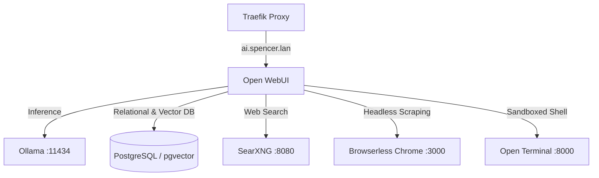

# Open WebUI

Open WebUI is the user-facing AI chat interface and workspace client, offering multi-model support, document RAG, metasearch integration, and code execution.

---

## 🎯 Overview & Architecture

* **Role**: Primary ChatGPT-style web interface.
* **Container Name**: `open-webui`
* **Image**: `ghcr.io/open-webui/open-webui:main`
* **Internal Port**: `8080`
* **External Ingress**: `https://ai.spencer.lan` via Traefik
* **Networks**:
  * `net1`: Traefik reverse proxy routing.
  * `ai`: Connection to Ollama (`http://ollama:11434`), Browserless, and Open Terminal.
  * `db`: Connection to PostgreSQL / pgvector database.

---

## ⚙️ Key Environment Variables

| Variable | Value / Reference | Purpose |
|---|---|---|
| `OLLAMA_BASE_URL` | `http://ollama:11434` | Backend LLM API endpoint |
| `WEBUI_SECRET_KEY` | `${OPENWEBUI_SECRET_KEY}` | Session signing secret key |
| `DATABASE_URL` | `postgresql://${POSTGRES_USER}:${POSTGRES_PASSWORD}@db:5432/${POSTGRES_DB}` | Relational database connection |
| `VECTOR_DB` | `pgvector` | Vector storage engine for document RAG |
| `VECTOR_DB_URI` | `postgresql://${POSTGRES_USER}:${POSTGRES_PASSWORD}@db:5432/${POSTGRES_DB}` | Vector DB connection string |
| `ENABLE_RAG_WEB_SEARCH` | `True` | Enables RAG web search tool |
| `RAG_WEB_SEARCH_ENGINE` | `searxng` | Web search provider |
| `SEARXNG_QUERY_URL` | `http://searxng:8080/search?q=<query>` | SearXNG query URL |
| `RAG_WEB_LOADER_ENGINE`| `playwright` | Web loader engine for scraping |
| `PLAYWRIGHT_WS_URI` | `ws://browserless:3000` | Browserless Chrome websocket |

---

## 📁 Mounted Volumes

| Host Path | Container Path | Purpose |
|---|---|---|
| `./open-webui` | `/app/backend/data` | Persists user files, uploads, and local database cache |
