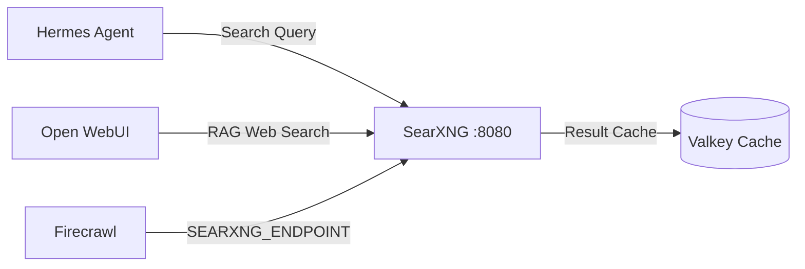

# SearXNG Metasearch Engine

SearXNG is a privacy-respecting metasearch engine aggregating search results across multiple providers without tracking user behavior.

---

## 🎯 Overview & Architecture

* **Role**: Centralized search query backend for Open WebUI, Hermes Agent, and Firecrawl.
* **Container Name**: `searxng`
* **Image**: `docker.io/searxng/searxng:${SEARXNG_VERSION:-latest}`
* **Internal Port**: `8080`
* **Networks**:
  * `ai`: Available to Open WebUI, Hermes Agent, and Firecrawl.
  * `redis`: Connected to Valkey for search query and engine response caching.



---

## ⚙️ Configuration Files

### 1. `searxng/config/settings.yml`
* **Formats**: Enabled `json` and `html` under `search.formats` to allow programmatic API queries from agents.
* **Valkey Integration**: Configured with `valkey://valkey:6379/0`.
* **Port**: Bound to internal port `8080`.

### 2. `searxng/config/limiter.toml`
* Configures rate-limiting and bot-protection thresholds.

---

## 📁 Mounted Volumes

| Host Path | Container Path | Purpose |
|---|---|---|
| `./searxng/config/` | `/etc/searxng/` | Configuration files (`settings.yml`, `limiter.toml`) |
| `./searxng/data/` | `/var/cache/searxng/` | Engine response and rate-limiting cache |

---

## 🛠️ Testing Queries Internally

```bash
docker compose exec hermes curl -s "http://searxng:8080/search?q=homelab&format=json"
```
