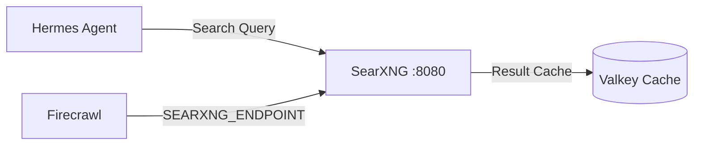

# SearXNG Metasearch Engine

SearXNG is a privacy-respecting metasearch engine aggregating search results across multiple providers without tracking user behavior.

---

## 🎯 Overview & Architecture

* **Role**: Centralized search query backend for Hermes Agent and Firecrawl.
* **Container Name**: `searxng`
* **Image**: `docker.io/searxng/searxng:${SEARXNG_VERSION:-latest}`
* **Internal Port**: `8080`
* **Networks**:
  * `ai`: Available to Hermes Agent and Firecrawl.
  * `redis`: Connected to Valkey for search query and engine response caching.


```mermaid
graph LR
    Hermes[Hermes Agent] -->|Search Query| SearXNG[SearXNG :8080]
    Firecrawl[Firecrawl] -->|SEARXNG_ENDPOINT| SearXNG
    SearXNG -->|Result Cache| Valkey[(Valkey Cache)]
```

---

## ⚙️ Configuration Files

### 1. `searxng/config/settings.yml`
* **Formats**: Enabled `json` and `html` under `search.formats` to allow programmatic API queries from agents.
* **Valkey Integration**: Configured with `valkey://valkey:6379/0`.
* **Port**: Bound to internal port `8080`.

### 2. `searxng/config/limiter.toml`
* Configures rate-limiting and bot-protection thresholds.

---

## 🛡️ Agent Vault Proxy Routing & Auditing

SearXNG routes all outbound search queries to public search engines through **Agent Vault** (`agent-vault:14322`):
* **Auditing & Protection**: Outbound engine requests (Google, Bing, DuckDuckGo, Wikipedia, etc.) are centralized and audited through the Agent Vault proxy.
* **Root CA Trust**: SearXNG mounts Agent Vault's CA certificate (`./agent-vault/data/ca.pem`) to `/etc/searxng/ca.pem` and `/etc/ssl/certs/agent-vault-ca.pem`, configured via `SSL_CERT_FILE`, `REQUESTS_CA_BUNDLE`, and `CURL_CA_BUNDLE`.
* **Internal Cache Exemption**: Inter-container connections to Valkey (`valkey:6379`) and local networks are exempted via `NO_PROXY=localhost,127.0.0.1,valkey,agent-vault,.spencer.lan`.

---

## 📁 Mounted Volumes

| Host Path | Container Path | Purpose |
|---|---|---|
| `./searxng/config/` | `/etc/searxng/` | Configuration files (`settings.yml`, `limiter.toml`) |
| `./searxng/data/` | `/var/cache/searxng/` | Engine response and rate-limiting cache |
| `./agent-vault/data/ca.pem` | `/etc/searxng/ca.pem:ro` | Agent Vault root CA certificate |
| `./agent-vault/data/ca.pem` | `/etc/ssl/certs/agent-vault-ca.pem:ro` | System root CA trust bundle |

---

## 🛠️ Testing Queries Internally

```bash
docker compose exec hermes curl -s "http://searxng:8080/search?q=homelab&format=json"
```

