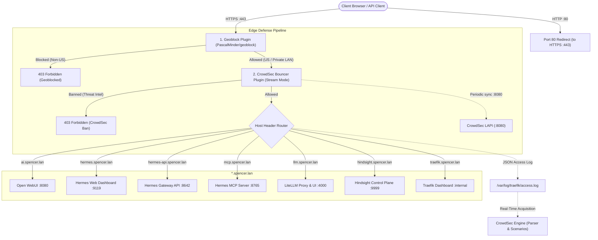

# Traefik Reverse Proxy

Traefik acts as the centralized edge router, SSL termination gateway, and reverse proxy for all inbound HTTP/HTTPS traffic to Spencer's Homelab, protected by the **CrowdSec Bouncer Plugin**.

---

## 🎯 Overview & Architecture

* **Role**: Single entry point for routing external and LAN requests to internal Docker containers based on host headers (`*.spencer.lan`).
* **Container Name**: `traefik`
* **Image**: `traefik:latest`
* **Network**: `net1` (Bridge network for routed web services)
* **Bound Host Ports**: `80:80` (HTTP), `443:443` (HTTPS)
* **Web UI / Dashboard**: `https://traefik.spencer.lan`
* **Plugins**:
  * `github.com/maxlerebourg/crowdsec-bouncer-traefik-plugin` (`v1.4.1`): Local API threat decision caching and ban enforcement.
  * `github.com/PascalMinder/geoblock` (`v0.3.8`): Inbound geographic filtering (US only allowlist with local RFC 1918 bypass).
* **Logging**: Structured JSON access logs written directly to `/var/log/traefik/access.log`.



---

## ⚙️ Configuration

Traefik uses a dual-configuration approach:

### 1. Static Configuration (`traefik/traefik.yml`)
Configures global entrypoints, API/Dashboard enablement, access logging, plugin registration, and provider declarations:
* **Entrypoints**:
  * `web` on `:80` with automatic permanent redirection to `websecure` (:443).
  * `websecure` on `:443` with `forwardedHeaders.trustedIPs` configured for private subnets, and global middleware chain `["geoblock@file", "crowdsec-bouncer@file"]` applied in order.
* **Access Logging**:
  * `filePath: /var/log/traefik/access.log`
  * `format: json`
* **Experimental Plugins**:
  * `crowdsec-bouncer`: `github.com/maxlerebourg/crowdsec-bouncer-traefik-plugin` (`v1.4.1`).
  * `geoblock`: `github.com/PascalMinder/geoblock` (`v0.3.8`).
* **Providers**:
  * `docker`: Watches Docker socket for container labels (`exposedByDefault: false`, network `net1`).
  * `file`: Dynamically watches `traefik/dynamic.yml` (`watch: true`).

> [!IMPORTANT]
> Changes to `traefik/traefik.yml` require a container restart:
> ```bash
> docker compose up -d --force-recreate traefik
> ```

### 2. Dynamic Configuration (`traefik/dynamic.yml`)
Configures dynamic TLS certificates, middlewares, and internal dashboard routing:
* **TLS Certificates**: Loads wildcard certificates from `traefik/certs/cert.pem` and `traefik/certs/key.pem`.
* **Middlewares**:
  * `redirect-to-https`: Permanent HTTPS scheme redirection middleware.
  * `geoblock`: Inbound country allowlist middleware configured with `countries: [US]`, `blackListMode: false`, `allowLocalRequests: true`, `xForwardedForReverseProxy: true`, and in-memory LRU cache (`cacheSize: 1000`).
  * `crowdsec-bouncer`: Stream mode middleware pointing to `http://crowdsec:8080`, reading the API key from `/etc/traefik/crowdsec_bouncer_key` with local subnet bypass (`127.0.0.1/32`, `192.168.0.0/16`, `10.0.0.0/8`).
* **Dashboard Router**: Routes `traefik.spencer.lan` to internal `api@internal` service.

---

## 📁 Mounted Volumes

| Host Path | Container Path | Purpose | Access |
|---|---|---|---|
| `./traefik/traefik.yml` | `/etc/traefik/traefik.yml` | Static configuration | Read/Write |
| `./traefik/dynamic.yml` | `/etc/traefik/dynamic.yml` | Dynamic configuration & TLS | Read/Write |
| `./traefik/acme.json` | `/etc/traefik/acme.json` | ACME storage (permissions 600) | Read/Write |
| `./traefik/certs` | `/etc/traefik/certs` | Wildcard TLS certificates | Read-Only |
| `./traefik/logs` | `/var/log/traefik` | JSON access log directory (read by CrowdSec) | Read/Write |
| `./traefik/crowdsec_bouncer_key` | `/etc/traefik/crowdsec_bouncer_key` | Secret key for CrowdSec bouncer authentication | Read-Only |
| `/var/run/docker.sock` | `/var/run/docker.sock` | Docker provider event socket | Read-Only |

---

## 🏷️ Service Registration Example

To expose any container via Traefik:
```yaml
services:
  my-service:
    image: my-service:latest
    networks:
      - net1
    labels:
      - "traefik.enable=true"
      - "traefik.http.routers.my-service.rule=Host(`myservice.spencer.lan`)"
      - "traefik.http.routers.my-service.entrypoints=websecure"
      - "traefik.http.routers.my-service.tls=true"
      - "traefik.http.services.my-service.loadbalancer.server.port=8080"
```
